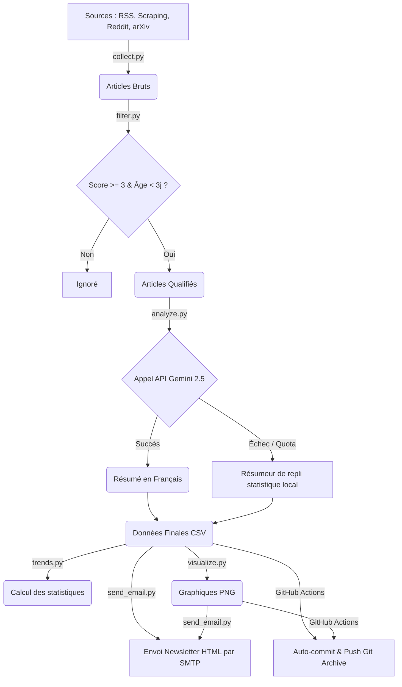

# Moniteur de Veille Technologique - Détection de Contenu IA

Ce projet est un pipeline automatisé d'ingestion, de filtrage, de synthèse intelligente et de diffusion d'informations axé sur les technologies de **détection de textes générés par IA**, le **watermarking des LLM**, les **techniques d'évasion/humanisation**, ainsi que l'**intégrité académique**.

Il s'exécute automatiquement toutes les 72 heures via GitHub Actions, met à jour une archive de données et envoie une newsletter HTML premium enrichie de graphiques analytiques aux destinataires configurés.

---

## 🚀 Fonctionnalités Clés

1. **Collecte Multi-Sources** :
   * **Flux RSS** : Suivi des blogs d'éditeurs leaders (GPTZero, Winston AI, Copyleaks, etc.) et médias tech (TechCrunch, Wired).
   * **Web Scraping (BeautifulSoup)** : Extraction directe sur les blogs sans flux RSS natifs (Originality.ai, Turnitin, Compilatio).
   * **API Reddit (JSON)** : Surveillance des communautés actives (r/ChatGPT, r/LocalLLaMA, r/education).
   * **API arXiv (Atom)** : Veille sur les publications académiques et scientifiques récentes (cs.CL, cs.AI).

2. **Filtrage Intelligent et Scoring** :
   * Classification automatique selon un dictionnaire de mots-clés structuré en 12 catégories.
   * Attribution d'un score pondéré (poids de 1 à 5).
   * Seuil de pertinence rigoureux (score $\ge 3$ et articles datant de moins de 3 jours) pour éliminer le bruit.

3. **Synthèse Narrative IA (Gemini 2.5 Flash & Repli)** :
   * Génération de résumés clairs, courts et pertinents en français via l'API Gemini.
   * **Résilience réseau** : Temporisation de 4 secondes pour respecter le quota gratuit de 15 requêtes par minute (RPM).
   * **Gestion des erreurs** : Boucle de réessai automatique avec attente exponentielle (backoff) en cas de code HTTP `429` (limite atteinte) ou `503`.
   * **Repli Statistique Local** : En cas de défaillance réseau ou d'indisponibilité de l'API, le script extrait automatiquement les phrases clés locales pour assurer la continuité du bulletin d'information.

4. **Analytique & Visualisation** :
   * Analyse automatique des tendances de mots-clés et répartition des catégories.
   * Génération automatique de deux graphiques au format PNG (Top 10 mots-clés et distribution thématique).

5. **Newsletter Premium Responsable** :
   * Conception d'un e-mail HTML au design moderne avec CSS *inline*.
   * Intégration en ligne (CIDs) des graphiques de tendances (pas de liens brisés).
   * Envoi SMTP sécurisé.

6. **Auto-archivage Git** :
   * Commits automatiques des données brutes, filtrées, analysées, statistiques et graphiques dans le dépôt toutes les 72 heures.

---

## 🛠️ Architecture du Pipeline



---

## 📂 Structure du Projet

```text
├── .github/workflows/
│   └── monitor.yml         # Définition du workflow d'automatisation GitHub Actions
├── data/                   # Données archivées (mises à jour par le bot)
│   ├── raw/                # Historique des articles collectés bruts (CSV)
│   ├── filtered/           # Articles ayant passé le filtre de pertinence (CSV)
│   ├── analyzed/           # Articles avec résumés finaux (CSV)
│   ├── trends/             # Statistiques de mots-clés et catégories (CSV)
│   └── visuals/            # Graphiques de tendances générés (PNG)
├── collect.py              # Logique de collecte de toutes les sources
├── filter.py               # Algorithme de filtrage et calcul du score de pertinence
├── analyze.py              # Génération des résumés (Gemini / Repli Local)
├── trends.py               # Calcul analytique des tendances thématiques
├── visualize.py            # Génération des graphiques analytiques avec Matplotlib
├── send_email.py           # Construction du template HTML et envoi de la newsletter
├── config.py               # Configuration globale (mots-clés, poids, sources, SMTP)
├── main.py                 # Orchestrateur principal exécutant le pipeline
├── requirements.txt        # Dépendances Python requises
└── README.md               # Documentation du projet
```

---

## ⚙️ Configuration & Installation

### 1. Prérequis
Assurez-vous d'avoir Python 3.9+ installé. Installez ensuite les dépendances :
```bash
pip install -r requirements.txt
```

### 2. Variables d'Environnement
Pour que le script fonctionne pleinement, vous devez définir les variables d'environnement suivantes :

| Variable | Description | Valeur par défaut (si omise) |
| :--- | :--- | :--- |
| `GEMINI_API_KEY` | Clé API pour résumer les articles. | *Requis pour les résumés IA* (sinon repli local) |
| `SMTP_HOST` | Hôte du serveur SMTP d'envoi. | `smtp.gmail.com` |
| `SMTP_PORT` | Port SMTP. | `587` |
| `SMTP_USER` | Identifiant d'authentification SMTP. | `""` *(Requis pour l'envoi)* |
| `SMTP_PASSWORD` | Mot de passe SMTP (mot de passe d'application). | `""` *(Requis pour l'envoi)* |
| `EMAIL_TO` | Destinataires des e-mails (séparés par des virgules). | `stoniot005@gmail.com, adanlienclounonprecieux877@gmail.com` |
| `FROM_EMAIL` | Adresse e-mail de l'expéditeur. | Valeur de `SMTP_USER` |
| `FROM_NAME` | Nom d'affichage de l'expéditeur. | `Veille Détection IA` |

---

## 🏃 Exécution en Local

Vous pouvez lancer le pipeline manuellement sur votre machine avec la commande :
```bash
python main.py
```
*Si les variables SMTP ou Gemini ne sont pas définies en local, le script s'exécutera tout de même grâce aux mécanismes de repli (affichage du mail dans la console et résumés statistiques locaux).*

---

## 🤖 Automatisation avec GitHub Actions

Le workflow défini dans `.github/workflows/monitor.yml` exécute le pipeline toutes les 72 heures.

### Configuration des Secrets sur GitHub
Pour activer l'envoi des mails et les résumés Gemini en production, allez dans votre dépôt sur GitHub : **Settings > Secrets and variables > Actions** et ajoutez les secrets suivants :

*   `GEMINI_API_KEY` : Votre clé API générée dans Google AI Studio.
*   `SMTP_USER` : L'adresse e-mail émettrice (ex: Gmail).
*   `SMTP_PASSWORD` : Le mot de passe d'application généré sur votre compte e-mail (ex: MDP d'application Google 16 caractères).

### Note sur les Quotas de la Clé API Gemini
Si vous utilisez la clé API Gemini en **mode gratuit**, celle-ci est limitée à **15 requêtes par minute (RPM)**. Bien que notre code intègre une pause automatique de 4 secondes et des tentatives de réessai avec attente exponentielle pour contourner cette limite, il est possible que des serveurs surchargés (erreurs 503) forcent le script à utiliser le résumeur local pour certains articles.

Pour garantir une synthèse 100 % fiable par Gemini sur tous les articles, il est recommandé d'associer un compte de facturation à votre projet dans Google AI Studio (**Pay-as-you-go**). Les tarifs de `gemini-2.5-flash` étant infimes (environ 0,075 $ pour 1 million de tokens), chaque run vous coûtera moins de **0,001 $**.

---

## 📝 Licence & Auteurs
Projet développé dans le cadre de la veille technologique pour le **LRSIA**.

*   **Auteurs** : Équipe de recherche et veille LRSIA.
*   **Version** : `1.0.0` (Release prête pour déploiement).
