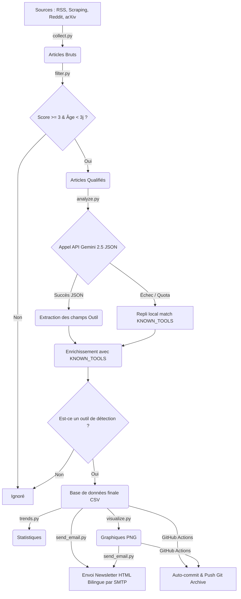

# Moniteur de Veille Technologique - Outils & Plateformes de Détection d'IA

Ce projet est un pipeline automatisé d'ingestion, de filtrage sémantique, d'analyse intelligente par IA et de diffusion d'informations entièrement focalisé sur les **outils et plateformes de détection de textes générés par IA**, le **watermarking des LLM**, les **techniques d'évasion/humanisation**, ainsi que l'**intégrité académique**.

Le pipeline s'exécute automatiquement toutes les 72 heures via GitHub Actions, stocke les résultats archivés dans le dépôt Git et envoie un bulletin de veille (newsletter) bilingue et responsive par e-mail, enrichi de graphiques analytiques.

---

## 🚀 Fonctionnalités Clés (Release 2)

1. **Veille Orientée Outils & Plateformes** :
   - Le pipeline filtre strictement les flux d'informations pour ne retenir **que** les articles ou publications parlant d'outils ou logiciels de détection (ex: GPTZero, Pangram Labs, Copyleaks, Turnitin, Compilatio...).
   - Extraction structurée et factuelle : nom de l'outil, nouveauté, métriques de performance (**taux de faux positifs**, précision, résistance au bypass) et pricing.

2. **Base de Données de Référence (`KNOWN_TOOLS`)** :
   - Intégration d'une base de données locale dans [config.py](config.py) contenant les métadonnées officielles de 10 détecteurs d'IA majeurs du marché.
   - Les informations extraites par Gemini sont enrichies automatiquement avec cette base de données (URL officielle, tarifs, benchmarks standards).

3. **Découverte Automatique des Nouveautés** :
   - Si le système identifie un nouvel outil de détection non répertorié dans la base locale, il lui attribue automatiquement un badge visuel marquant **`[NEW TOOL]` / `[NOUVEL OUTIL]`** dans le rapport de veille.

4. **Newsletter Bilingue Premium** :
   - Génération d'un e-mail HTML responsive bilingue :
     - **Section supérieure** entièrement rédigée en **Anglais (EN)**.
     - **Ligne de séparation en tirets** élégante avec le label "Version Française".
     - **Section inférieure** entièrement rédigée en **Français (FR)**.
   - Boutons d'appel à l'action ("Try Tool" / "Essayer l'outil") renvoyant vers le lien direct de test.

5. **Ingestion Multi-Sources & Filtrage** :
   - **Flux RSS** : Blogs d'éditeurs leaders et grands médias tech (Wired, TechCrunch).
   - **Scraping HTML** : Extraction robuste des blogs n'ayant pas de RSS natif (Originality.ai, Turnitin, Compilatio).
   - **API Reddit (JSON)** : Surveillance de r/ChatGPT, r/LocalLLaMA et r/education.
   - **API arXiv (Atom)** : Capture des publications scientifiques récentes.
   - Filtrage sémantique : Calcul d'un score de pertinence pondéré (seuil $\ge 3$) et filtre d'âge (< 3 jours).

6. **Résilience et Mode de Repli** :
   - Respect strict des quotas Gemini gratuit (15 RPM) grâce à des pauses et des mécanismes de réessai exponentiels en cas d'erreurs `429` ou `503`.
   - **Bascule automatique en local** : Si la clé Gemini est absente ou échoue, le système utilise un résumeur statistique et scanne le texte pour matcher les outils connus, préservant la structure du rapport.

---

## 🛠️ Architecture du Pipeline



---

## 📂 Structure du Projet

```text
├── .github/workflows/
│   └── monitor.yml         # Définition du workflow d'automatisation GitHub Actions
├── data/                   # Données archivées (mises à jour par le bot toutes les 72h)
│   ├── raw/                # Historique des articles collectés bruts (CSV)
│   ├── filtered/           # Articles ayant passé le filtre de pertinence (CSV)
│   ├── analyzed/           # Outils avec résumés finaux et performances (CSV)
│   ├── trends/             # Statistiques de mots-clés et catégories (CSV)
│   └── visuals/            # Graphiques de tendances générés (PNG)
├── collect.py              # Logique de collecte de toutes les sources (RSS, scrapers, APIs)
├── filter.py               # Algorithme de filtrage et calcul du score de pertinence
├── analyze.py              # Extraction sémantique des outils (Gemini JSON / Repli Local)
├── trends.py               # Calcul analytique des tendances thématiques
├── visualize.py            # Génération des graphiques analytiques avec Matplotlib
├── send_email.py           # Construction du template HTML bilingue et envoi de l'e-mail
├── config.py               # Configuration globale (mots-clés, base KNOWN_TOOLS, SMTP)
├── main.py                 # Orchestrateur principal exécutant le pipeline de bout en bout
├── requirements.txt        # Dépendances Python requises
└── README.md               # Cette documentation du projet
```

---

## ⚙️ Configuration & Installation

### 1. Prérequis
Assurez-vous d'avoir Python 3.9+ installé. Installez ensuite les dépendances :
```bash
pip install -r requirements.txt
```

### 2. Variables d'Environnement
Pour que le script fonctionne pleinement, vous devez définir les variables d'environnement suivantes :

| Variable | Description | Valeur par défaut (si omise) |
| :--- | :--- | :--- |
| `GEMINI_API_KEY` | Clé API pour résumer les articles. | *Requis pour l'analyse IA* (sinon repli local) |
| `SMTP_HOST` | Hôte du serveur SMTP d'envoi. | `smtp.gmail.com` |
| `SMTP_PORT` | Port SMTP. | `587` |
| `SMTP_USER` | Identifiant d'authentification SMTP. | `""` *(Requis pour l'envoi)* |
| `SMTP_PASSWORD` | Mot de passe SMTP (mot de passe d'application). | `""` *(Requis pour l'envoi)* |
| `EMAIL_TO` | Destinataires des e-mails (séparés par des virgules). | `destinataire1@mail.com, destinataire2@mail.com` |
| `FROM_EMAIL` | Adresse e-mail de l'expéditeur. | Valeur de `SMTP_USER` |
| `FROM_NAME` | Nom d'affichage de l'expéditeur. | `Veille Détection IA` |

---

## 🏃 Exécution en Local

Vous pouvez lancer le pipeline manuellement sur votre machine avec la commande :
```bash
python main.py
```
*Si les variables SMTP ou Gemini ne sont pas définies en local, le script s'exécutera tout de même grâce aux mécanismes de repli (affichage d'un aperçu textuel bilingue de la newsletter dans la console et utilisation de la base de données locale `KNOWN_TOOLS`).*

---

## 🤖 Automatisation avec GitHub Actions

Le workflow défini dans `.github/workflows/monitor.yml` exécute le pipeline toutes les 72 heures.

### Configuration des Secrets sur GitHub
Pour activer l'envoi des mails et les résumés Gemini en production, allez dans votre dépôt sur GitHub : **Settings > Secrets and variables > Actions** et ajoutez les secrets suivants :

*   `GEMINI_API_KEY` : Votre clé API générée dans [Google AI Studio](https://aistudio.google.com/).
*   `SMTP_USER` : L'adresse e-mail émettrice (ex: Gmail).
*   `SMTP_PASSWORD` : Le mot de passe d'application généré sur votre compte e-mail (ex: MDP d'application Google 16 caractères).
*   `EMAIL_TO` : L'adresse e-mail ou la liste d'adresses devant recevoir le rapport.

### Note sur les Quotas de la Clé API Gemini
Si vous utilisez la clé API Gemini en **mode gratuit**, celle-ci est limitée à **15 requêtes par minute (RPM)**. Notre code intègre une pause automatique de 4 secondes et des tentatives de réessai avec attente exponentielle pour contourner cette limite.

Pour garantir une synthèse 100 % fiable et rapide par Gemini sur tous les articles, il est recommandé d'associer un compte de facturation à votre projet dans [Google AI Studio](https://aistudio.google.com/) (**Pay-as-you-go**). Les tarifs de `gemini-2.5-flash` étant infimes (environ 0,075 $ pour 1 million de tokens), chaque run vous coûtera moins de **0,001 $**.

---

## 📝 Licence & Auteurs
Développé pour l'équipe veille du **LRSIA** (Laboratoire de Recherche en Sécurité Informatique et Automatique - IFRI-UAC).
Site officiel du LRSIA : [https://lrsia.ifri-uac.bj/](https://lrsia.ifri-uac.bj/)
